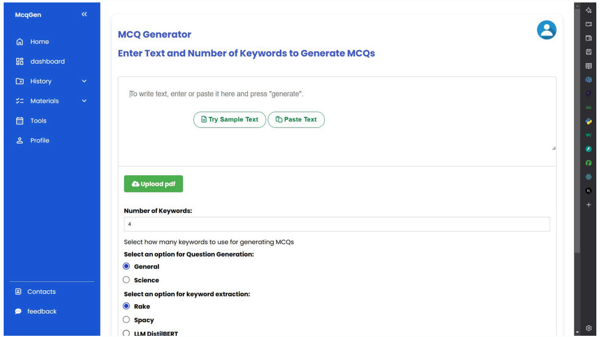
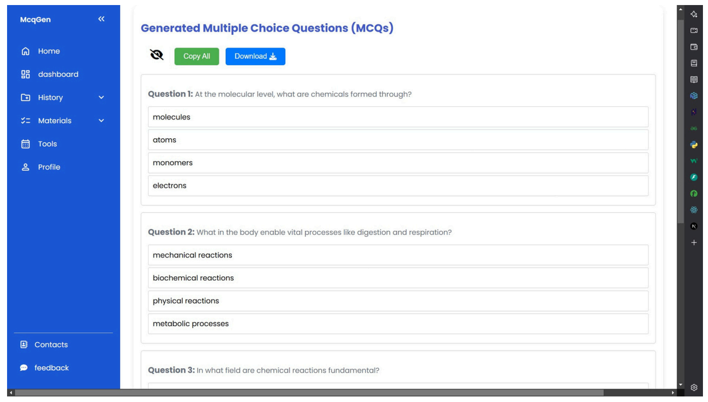

# MCQs Generation Web App

A web application that leverages advanced NLP and Large Language Models (LLMs) such as BERT, T5, and Llama 3.2 to automatically generate multiple-choice questions (MCQs) from textual content. The platform allows users to log in, generate quizzes, and test their knowledge with dynamically created questions.

## Features

- **Automated MCQ Generation:** Generate high-quality multiple-choice questions from input text using state-of-the-art LLMs.
- **Supports Multiple LLMs:** Option to use models like BERT, T5, and Llama 3.2 for varied question styles and complexity.
- **User Authentication:** Secure user login and registration system.
- **Quiz & Test Yourself:** Interactive quizzes to assess your understanding based on generated questions.
- **User Dashboard:** View quiz history and manage your account.

## Demo




## Getting Started

### Prerequisites

- Python 3.x installed
- Django framework
- (Recommended) Virtual environment tool such as `venv`
- Required NLP/LLM model weights (see setup instructions)

### Installation

1. **Clone the repository:**
    ```bash
    git clone https://github.com/BirendraKSharma/mcqs_generation.git
    cd mcqs_generation
    ```

2. **Create and activate a virtual environment:**
    ```bash
    python -m venv myenv
    # On Windows:
    myenv\Scripts\activate
    # On Unix or MacOS:
    source myenv/bin/activate
    ```

3. **Install dependencies:**
    ```bash
    pip install -r requirements.txt
    ```

4. **Set up LLM/NLP models:**
    - Download or configure pre-trained models (BERT, T5, Llama 3.2) as per the instructions in the project documentation or scripts.
    - Ensure model paths/configurations are set correctly in the Django settings or environment file.

5. **Apply Django migrations:**
    ```bash
    python manage.py migrate
    ```

6. **Run the development server:**
    ```bash
    python manage.py runserver
    ```
    The application will be available at `http://127.0.0.1:8000/` by default.

## Usage

1. Open your browser and navigate to `http://127.0.0.1:8000/`.
2. Register or log in as a user.
3. Input text or select content for MCQ generation.
4. Take quizzes based on generated questions and view your scores.
5. Track your quiz history and progress in the dashboard.

## Project Structure

- `manage.py`: Django project management script.
- `mcqs_generator/`: Main Django app handling MCQ generation logic.
- `accounts/`: User authentication and profile management.
- `templates/`: HTML templates for the web interface.
- `static/`: Static files (CSS, JS, images).
- `requirements.txt`: Python dependencies.
- `screenshots/`: Demo images (not included in version control).

## Dependencies

Major libraries used (see `requirements.txt` for full list):
- Django
- Transformers (HuggingFace)
- torch
- numpy
- pandas
- (Add any other model-specific dependencies here)

## Contributing

Contributions are welcome! Please open an issue or submit a pull request.

## License

This project is licensed under the [MIT License](LICENSE).

## Contact

For questions or feedback, open an issue on this repository or contact the maintainer: [BirendraKSharma](https://github.com/BirendraKSharma)
